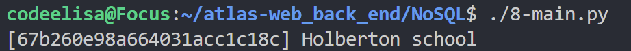
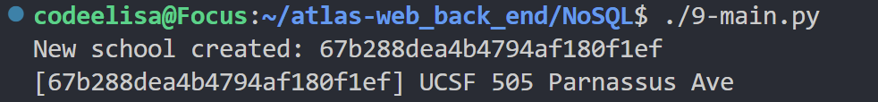
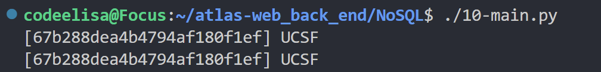
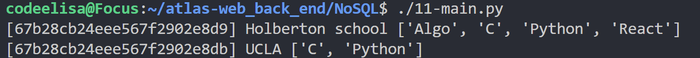
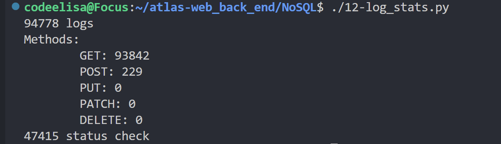

# NoSQL and MongoDB Guide

## Showing how python script runs in my env







## What is ACID?

ACID stands for **Atomicity, Consistency, Isolation, and Durability**. These properties ensure that database transactions are processed reliably:

1. **Atomicity** - A transaction is either fully completed or fully rolled back.
2. **Consistency** - The database remains in a valid state before and after a transaction.
3. **Isolation** - Transactions are executed independently to prevent conflicts.
4. **Durability** - Once a transaction is committed, it remains saved even in case of system failure.

## What is Document Storage?

Document storage is a type of **NoSQL database** that stores data in **JSON-like (BSON) documents** instead of relational tables. Each document contains key-value pairs that allow for flexible schema design. Examples include MongoDB, CouchDB, and Firebase Firestore.

## What are NoSQL Types?

NoSQL databases come in different types, each designed for specific use cases:

1. **Document Stores** - Store semi-structured data in JSON-like documents (e.g., MongoDB, CouchDB).
2. **Key-Value Stores** - Store data as key-value pairs for fast lookups (e.g., Redis, DynamoDB).
3. **Column-Family Stores** - Store data in column-oriented formats optimized for large-scale data (e.g., Cassandra, HBase).
4. **Graph Databases** - Store and manage relationships efficiently (e.g., Neo4j, ArangoDB).

## What Are the Benefits of a NoSQL Database?

NoSQL databases offer several advantages over traditional relational databases:

- **Scalability** - Easily scale out by adding more nodes (horizontal scaling).
- **Flexibility** - Schema-less design allows storing different structures in a single collection.
- **High Performance** - Optimized for fast read/write operations.
- **Distributed Architecture** - Provides high availability and fault tolerance.
- **Better Handling of Big Data** - Suited for large-scale applications, IoT, and real-time analytics.

## How to Query Information from a NoSQL Database?

Querying data from a NoSQL database depends on the type of NoSQL database used. For MongoDB, use the **find()** method:

```javascript
// Find all documents in a collection
db.collection.find({});

// Find a document with a specific field value
db.collection.find({ key: "value" });

// Find documents with a condition
db.collection.find({ age: { $gt: 25 } });
```

## How to Insert, Update, and Delete Information from a NoSQL Database?

### **Insert Data**

```javascript
// Insert a single document
db.collection.insertOne({ name: "John", age: 30 });

// Insert multiple documents
db.collection.insertMany([{ name: "Alice" }, { name: "Bob" }]);
```

### **Update Data**

```javascript
// Update a single document
db.collection.updateOne({ name: "John" }, { $set: { age: 31 } });

// Update multiple documents
db.collection.updateMany({ age: { $lt: 25 } }, { $set: { status: "young" } });
```

### **Delete Data**

```javascript
// Delete a single document
db.collection.deleteOne({ name: "John" });

// Delete multiple documents
db.collection.deleteMany({ age: { $lt: 18 } });
```

## How to Use MongoDB?

### **Installing MongoDB**

1. Download MongoDB from [MongoDB's official site](https://www.mongodb.com/try/download/community).
2. Install and start the MongoDB service.
3. Use the MongoDB shell or GUI tools like **MongoDB Compass**.

### **Basic Commands in MongoDB**

```javascript
// Show all databases
show dbs

// Switch to a database
use myDatabase

// Show all collections in a database
show collections

// Create a collection
db.createCollection("users")

// Drop a collection
db.users.drop()
```

### **Using MongoDB in an Application**

MongoDB can be used with various programming languages like Python, Node.js, and Java. Example with **Node.js and Mongoose**:

```javascript
const mongoose = require("mongoose");

mongoose.connect("mongodb://localhost:27017/myDatabase", {
  useNewUrlParser: true,
  useUnifiedTopology: true,
});

const UserSchema = new mongoose.Schema({ name: String, age: Number });
const User = mongoose.model("User", UserSchema);

// Insert a new user
const newUser = new User({ name: "Alice", age: 25 });
newUser.save().then(() => console.log("User saved"));
```

🚀 MongoDB is a powerful NoSQL database that provides flexibility and scalability for modern applications!
